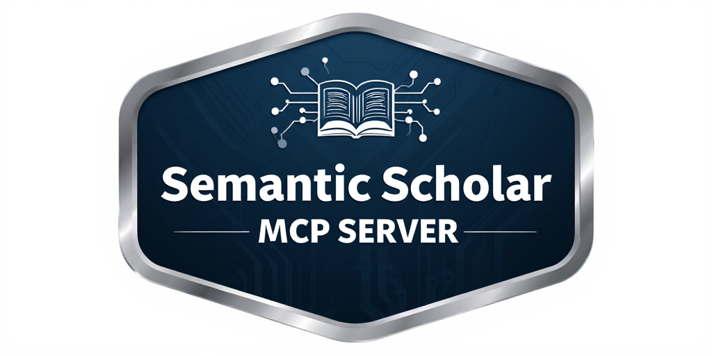

<table style="border: none;">
<tr>
<td width="66%" style="vertical-align: top; border: none;">

# Semantic Scholar MCP Server

A powerful wrapper for the [Semantic Scholar Graph API](https://api.semanticscholar.org/) implemented as an MCP (Multi-agent Control Protocol) server. This server provides a collection of tools for academic research agents to seamlessly access and query the Semantic Scholar database of academic papers, authors, and citations.

</td>
<td width="34%" style="text-align: center; border: none;">



</td>
</tr>
</table>

## Features

- **Comprehensive API Coverage**: Access to key Semantic Scholar endpoints including papers, authors, citations, references, and snippets
- **Batch Operations**: Efficient batch retrieval of multiple papers or authors in a single request
- **Advanced Search**: Support for keyword search, metadata matching, and snippet search
- **Authentication Support**: Optional API key configuration for higher rate limits
- **User-Friendly**: Well-documented tools with clear parameter descriptions and validation
- **Multi-agent Compatible**: Designed to work seamlessly with MCP-based agent systems

## Installation

### Prerequisites

- Python 3.12 or higher
- pip (Python package manager)

### Setup

1. Clone the repository:

```bash
git clone https://github.com/yourusername/Semantic-Scholar-MCP-Server.git
cd Semantic-Scholar-MCP-Server
```

2. Install the required dependencies:

```bash
# after enter conda or uv environment
pip install -e .
```

This will install the following dependencies:
- `mcp`: For running the MCP server
- `requests>=2.31`: For making HTTP requests to the Semantic Scholar API
- `pyyaml>=6.0`: For parsing configuration files

## Configuration

### API Key Setup (Optional but Recommended)

The Semantic Scholar API can be used without an API key, but with stricter rate limits. To use an API key:

1. Obtain an API key from [Semantic Scholar](https://www.semanticscholar.org/product/api)

2. Configure the API key using one of these methods:

   **Method 1: Environment Variable** (Recommended for production)
   ```bash
   export SEMANTIC_SCHOLAR_API_KEY=your_api_key_here
   ```

   **Method 2: Configuration File**
   Edit the `config.yaml` file in the project directory:
   ```bash
   semantic_scholar:
   api_key: your_api_key_here
   ```

### Server Configuration

The server configuration is defined in the `server.py` file. The default settings are:
- Host: `127.0.0.1`
- Port: `6666`
- Transport: `sse` (Server-Sent Events)

You can modify these settings by editing the relevant lines in `server.py`:

```python
mcp = FastMCP("Semantic-Scholar-MCP", host="127.0.0.1", port=6666)

# And later in the file
if __name__ == "__main__":
    mcp.run(transport="sse")
```

## Usage

### Starting the Server

To start the MCP server, run:

```bash
python server.py
```

The server will start listening for requests on the configured host and port.

### Available Tools

The server provides the following tools for interacting with the Semantic Scholar API:

#### Paper Tools
- `get_paper`: Retrieve a single paper by ID
- `get_papers_batch`: Batch retrieve multiple papers
- `search_papers`: Search for papers with filters
- `search_papers_bulk`: Bulk search with multiple queries
- `search_papers_match`: Find papers matching metadata
- `paper_autocomplete`: Get autocomplete suggestions for paper titles
- `get_paper_authors`: List authors of a paper
- `get_paper_citations`: List papers citing a specific paper
- `get_paper_references`: List papers referenced by a specific paper

#### Author Tools
- `get_author`: Retrieve an author by ID
- `get_authors_batch`: Batch retrieve multiple authors
- `search_authors`: Search for authors
- `get_author_papers`: List papers by an author

#### Snippet Tools
- `snippet_search`: Search for relevant snippets/passages in papers

### Tool Usage Examples

#### Get Paper Information

```python
# Example: Get paper information by DOI
get_paper(paper_id="DOI:10.1145/3474123.3486132")

# Example: Get paper with specific fields
get_paper(
    paper_id="arXiv:1706.03762",
    fields=["title", "authors", "year", "abstract", "citationCount"]
)
```

#### Search Papers

```python
# Example: Search for papers on machine learning
search_papers(
    query="machine learning",
    limit=10,
    year="2022-2024",
    fields_of_study=["Computer Science"]
)
```

#### Get Author Information

```python
# Example: Get author information
get_author(author_id="123456789")

# Example: Get author's papers
get_author_papers(
    author_id="123456789",
    limit=5,
    sort="citationCount"
)
```

## API Reference

### General Parameters

Most tools accept the following common parameters:

- `fields`: Specify which fields to include in the response (comma-separated string or list)
- `limit`: Maximum number of results to return
- `offset`: Pagination offset for retrieving additional results

### Rate Limits

Be aware of Semantic Scholar's API rate limits:
- Without API key: Approximately 100 requests per 5 minutes
- With API key: Higher rate limits based on your account tier

## Error Handling

Tools will raise descriptive errors in case of invalid parameters or API failures. Common errors include:

- Invalid parameter values (empty strings, incorrect types)
- Exceeding API limits
- Resource not found (invalid IDs)
- Network connectivity issues

## Development

### Adding New Tools

To add a new tool to interact with the Semantic Scholar API:

1. Create a new function decorated with `@mcp.tool()`
2. Implement parameter validation
3. Use the `_request_json` helper for making API calls
4. Return JSON-serialized response

Example:

```python
@mcp.tool()
def new_tool(param1, param2=None):
    # Validate parameters
    if not param1:
        raise ValueError("param1 is required")
    
    # Prepare request
    params = {"param1": param1}
    if param2:
        params["param2"] = param2
    
    # Make API call
    data = _request_json("GET", "/endpoint/path", params=params)
    
    # Return response
    return json.dumps(data, ensure_ascii=False)
```

### Testing

Currently, the project doesn't include a formal test suite. Manual testing is recommended during development.

## License

This project is licensed under the MIT License - see the LICENSE file for details.

## Acknowledgments

- [Semantic Scholar](https://www.semanticscholar.org/) for providing the API
- MCP framework developers for the multi-agent protocol implementation

## Contributing

Contributions are welcome! Please feel free to submit a Pull Request.

When contributing, please ensure:
1. Code follows the existing style and conventions
2. New tools include comprehensive documentation
3. Proper error handling is implemented
4. Parameters are properly validated
